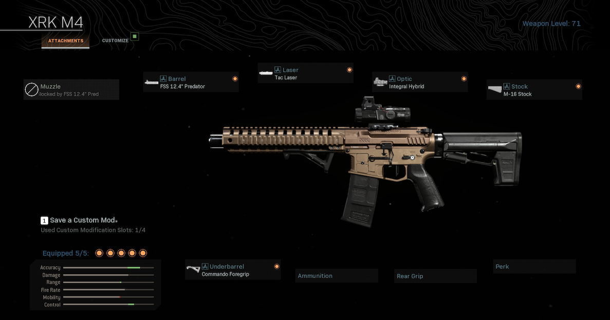
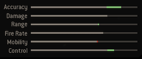
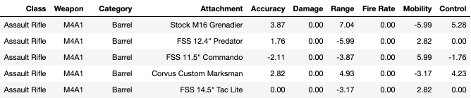
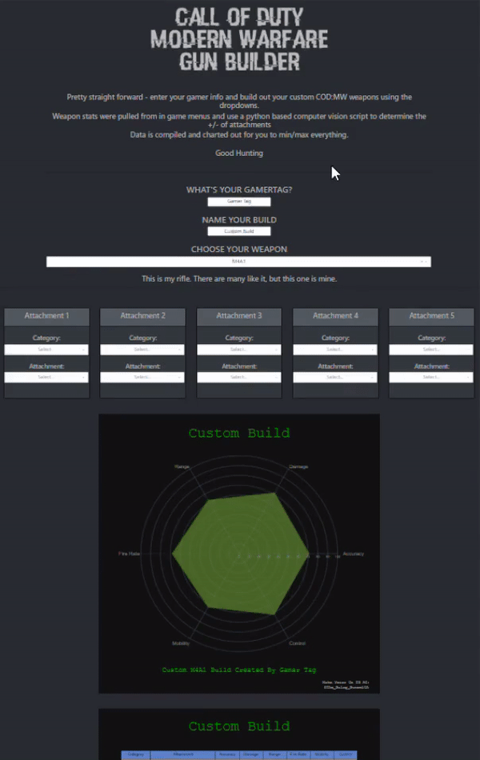
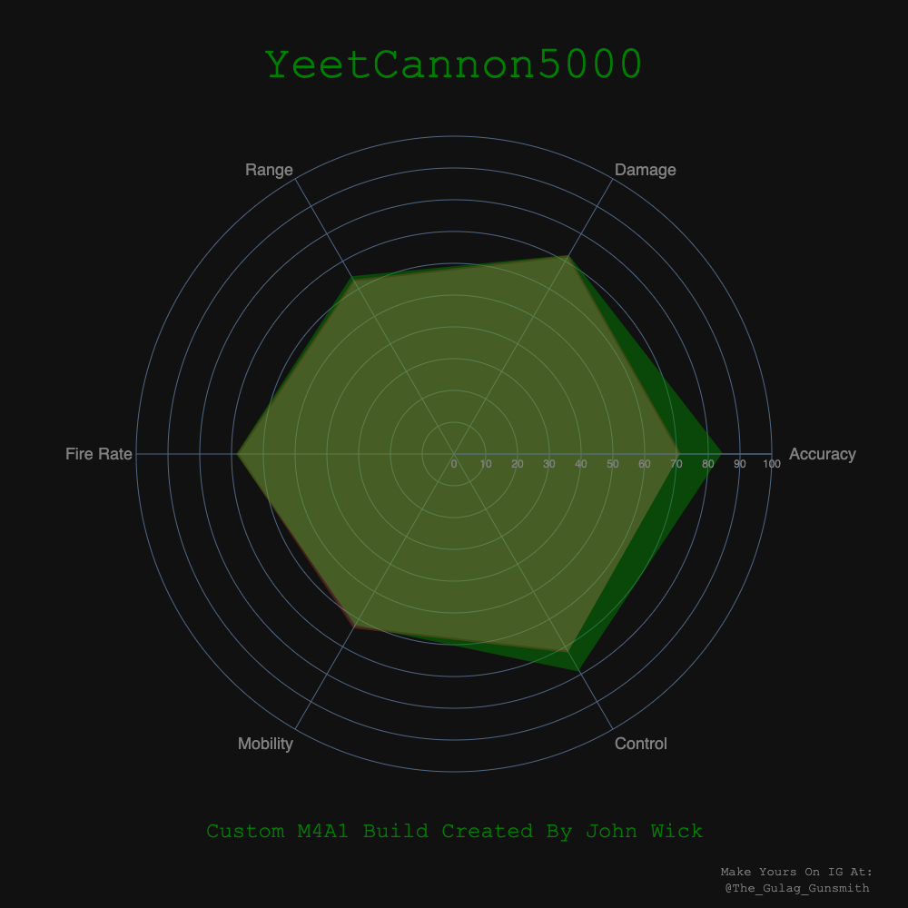
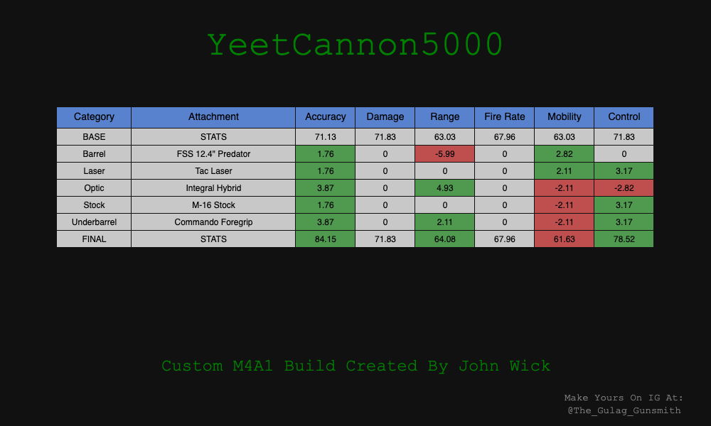

# Call of Duty Modern Warfare Weapon Attachment Visualizations

I've been playing first person shooters for a long time (shoutout to the GOAT CS 1.6)

Gaming weapon customization has come a long way from then.

In the latest Call of Duty : Modern Warfare (not to be confused with 2007's Call of Duty 4 : Modern Warfare) they take it to the next level.

Each weapon can have up to 5 attachments on it to tweak the stats of the weapon to better match either your playstyle or to make a special purpose build for a certain scenario.

Each of these attachments boosts certain stats and detracts from others.  The overall stats of the weapon is displayed in the table in the lower left corner.

Unfortunately, the in game gunsmith menu does not give you precise stats regarding the +/- of the attributes just the aggregate in the final table.

I wanted to build a system that can quantify the effects of each attachment on the weapon then use that information to optimize builds for certain attributes.

However, each weapon has about 50-60 unique attachments spread across roughly 9 categories resulting in an astounding number of potential combinations.

Luckily we can use computers to do the majority of the heavy lifting.

In a nut shell, I wrote a python script that implements computer vision to identify and categorize each attachment from an in game screenshot.  Once labeled, the script then analyzes the stats table to obtain the +/- of each attachment by counting colored pixels from each category.  Information is saved to a CSV and fed to a python based dash app hosted on heroku for anyone to build their loadout and analyze it with the hard numbers from each attachment.

Here's a preview of the data table generated after running the script:

With the help of the open Computer Vision Package, the hardest part of this project was leveling up all the weapons (thank god for 24/7 shipment and double weapon XP tokens)

Prior to the season 4 mid season update with the Rytec AMR, there were a total of 43 unique weapons with 2,322 total unique attachments.

With the help of the script, it is all processed in a matter of minutes with my 2012 Macbook.

All this data is fed to my webpage called "The Gulag Gunsmith"

It uses a live updating radar chart to help visualize the stats but more importantly show a table with the +/- of each category for each attachment.

Users can save and share their builds to add to the discussion of which gun is the new meta.

Check it out here and try out your own build!

https://the-gulag-gunsmith.herokuapp.com/

More developments to come

Stay Frosty my friends

